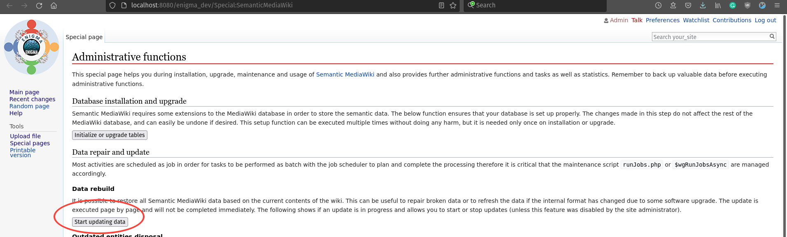

# Upload ontology into MediaWiki

The Data Source (in this case: MediaWiki) needs the ontology to describe the data

💡 In this documentation, we are going to use the ENIGMA ontology. If you are going working in a different science field, you must create a new ontology or use an existing one.

You can obtain the ENIGMA ontology from [Enigma Ontology](https://github.com/KnowledgeCaptureAndDiscovery/EnigmaOntology/releases/download/stb1.0/enigma_stb.ttl)

To upload the ontology into MediaWiki, you must follow the next steps:

1. Go to [http://localhost:9080/your_site/Special:WTBootstrap](http://localhost:9080/your_site/Special:WTBootstrap)
    
    Paste the `ontology url` and click `Submit query` 
    
2. Go to  [http://localhost:9080/your_site/Special:SemanticMediaWiki](http://localhost:9080/your_site/Special:SemanticMediaWiki) and click `Start updating data`
    
    
    
3. Go to [http://localhost:8080/enigma_dev/Special:WTBootstrap](http://localhost:8080/enigma_dev/Special:WTBootstrap). You can see the *classes* and *properties*

